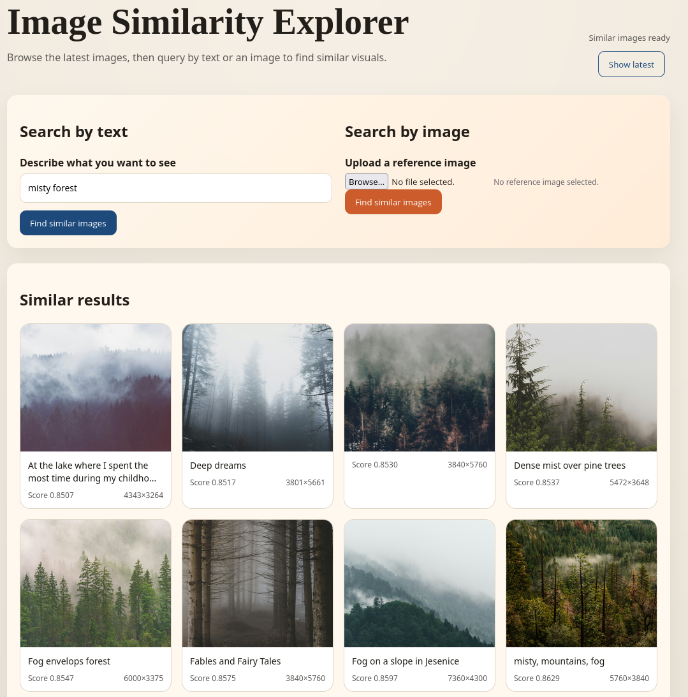

# Image Similarity Explorer

A prototype for content similarity search demo. The core user flow is: a user uploads content (image or text), and the system returns the most similar existing items. The existing items are images from unsplash.

## Components

- FastAPI backend with pgvector for storage/search
- FastAPI inference service using SigLIP2
- a toy React + Vite frontend UI
- Postgres for ANN embedding search

## Showcase

Image similarity:


Text similarity:



## Quick start

```bash
docker compose up --build
```

Services:
- Frontend: http://localhost:5173
- Backend API: http://localhost:8000/docs
- Inference API: http://localhost:8001/docs
- Postgres (pgvector): localhost:5432 (postgres / postgres)

## Indexing data

The backend includes a bulk indexing job that pulls the `1aurent/unsplash-lite` dataset,
downloads images, embeds them via the inference service, and upserts into Postgres.

```bash
docker compose --profile indexing run --rm --build indexer-job
```

## Development (hot reload)

```bash
docker compose -f docker-compose.yml -f docker-compose.dev.yaml up --build
```

## Key environment variables

Backend / indexer:
- `MAX_ITEMS` (default: 1000)
- `BULK_SIZE` (default: 30)
- `INFERENCE_BATCH_SIZE` (default: 30)

Inference:
- `MODEL_ID` (default: google/siglip2-so400m-patch14-384)
- `DEVICE` (default: cpu; set to `cuda` for GPU)

Frontend:
- `VITE_API_BASE` (default: http://localhost:8000)

## API overview

Backend:
- `POST /search/text`
- `POST /search/image`
- `GET /images`
- `GET /items/{item_id}`
- `GET /health`

Inference:
- `POST /embed/text`
- `POST /embed/image`
- `GET /health`
